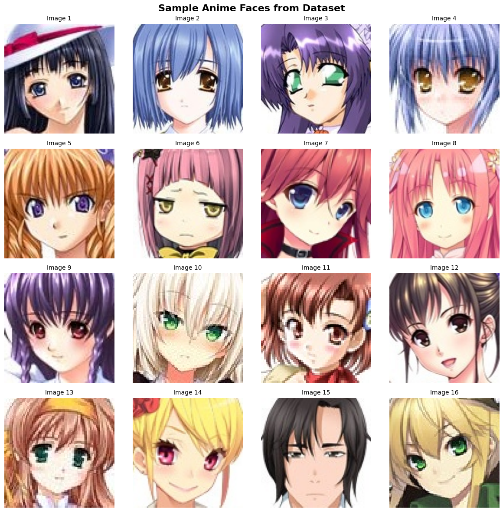
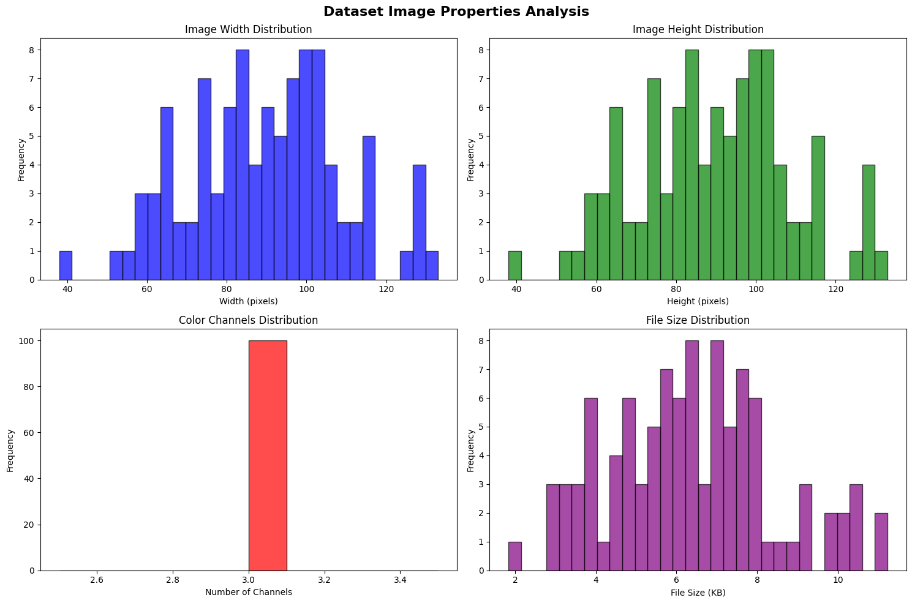
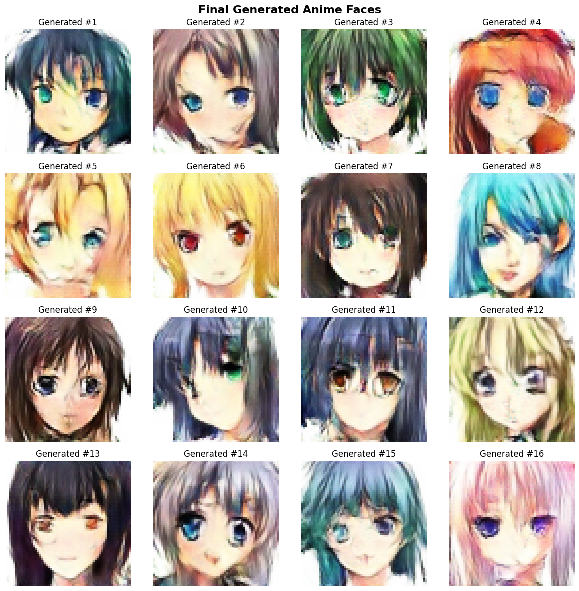
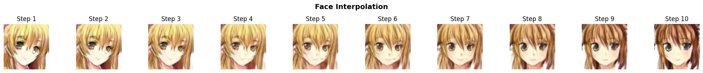

# Anime Face Images GAN

This project implements a Generative Adversarial Network (GAN) to generate anime face images. The model is built using PyTorch and Tensorflow, trained on a dataset of anime character faces.



## Table of Contents
- [Project Description](#project-description)
- [Dataset](#dataset)
- [Requirements](#requirements)
- [Installation](#installation)
- [Usage](#usage)
- [Model Architecture](#model-architecture)
- [Training](#training)
- [Results](#results)
- [Future Work](#future-work)
- [Contributing](#contributing)
- [License](#license)
- [Acknowledgements](#acknowledgements)

## Project Description

Generative Adversarial Networks (GANs) are a class of machine learning frameworks where two neural networks, a Generator (G) and a Discriminator (D), contest with each other in a zero-sum game. The Generator tries to produce realistic samples (in this case, anime faces) from random noise, while the Discriminator tries to distinguish between real images from the dataset and fake images produced by the Generator. Through this adversarial process, both networks improve, leading to the Generator producing increasingly realistic images.

This repository provides an implementation of a GAN specifically for generating anime faces. The core logic and model definitions can be found in the `anime-face-image-gan-pytorch.ipynb` and `anime-face-image-gan-tensorflow.ipynb` Jupyter Notebooks.

## Dataset

The model is trained on a dataset of anime character faces. You will need to procure a dataset of anime faces. A common dataset for this purpose is the "Anime Face Dataset" which can be found on platforms like Kaggle.

1.  **Download the dataset.**
2.  **Organize the dataset:** Ensure all face images are in a single directory.
3.  **Place the dataset:** Create a directory named `dataset` in the root of this project and place all your image files into `dataset/your_image_folder_name/`. The notebooks will need to be updated to point to the correct path if it's different from the default expected (e.g., `dataset/images/`).
   



**Example structure:**
```
AnimeFaceImages-GAN/
├── dataset/
│   └── anime_faces/  <-- Your images here
│       ├── 00001.png
│       ├── 00002.png
│       └── ...
├── images/
│   ├── image.png
│   └── image2.png
├── AnimeFaceImagesGAN.ipynb
├── README.md
└── .gitignore
```

## Requirements

The primary requirements for this project are:
* Python 3.x
* PyTorch
* Torchvision
* Tensorflow
* NumPy
* Matplotlib
* Jupyter Notebook (for running the `.ipynb` file)

You can install these using pip:
```bash
pip install tensorflow
pip install numpy matplotlib jupyter
pip install torch torchvision torchaudio
```

It is highly recommended to use a virtual environment.

## Installation

1.  **Clone the repository:**
    ```bash
    git clone [https://github.com/babakshofficial/AnimeFaceImages-GAN.git](https://github.com/babakshofficial/AnimeFaceImages-GAN.git)
    cd AnimeFaceImages-GAN
    ```

2.  **Set up a Python virtual environment (optional but recommended):**
    ```bash
    python -m venv venv
    source venv/bin/activate  # On Windows use `venv\Scripts\activate`
    ```

3.  **Install dependencies:**
    ```bash
    pip install -r requirements.txt
    ```
    *(Note: You might need to create a `requirements.txt` file by running `pip freeze > requirements.txt` in your environment after installing the packages listed above if one doesn't exist in the repo).*

4.  **Download and place the dataset** as described in the [Dataset](#dataset) section.

## Usage

1.  **Open the Jupyter Notebook:**
    ```bash
    jupyter notebook AnimeFaceImagesGAN.ipynb
    ```
2.  **Modify dataset path (if needed):** Inside the notebook, locate the section where the dataset is loaded. Ensure the path correctly points to your dataset directory.
3.  **Run the cells:** Execute the cells in the notebook sequentially to define the model, load data, train the GAN, and generate images.
4.  **View results:** The notebook should display generated images at various stages of training and at the end.

## Model Architecture

The GAN consists of two main components:

* **Generator (G):** Takes a random noise vector as input and outputs an image. The architecture typically involves a series of transposed convolutional layers (also known as deconvolutional layers) to upsample the noise into an image. Activation functions like ReLU and Tanh are commonly used.
* **Discriminator (D):** Takes an image (either real from the dataset or fake from the Generator) as input and outputs a probability that the image is real. The architecture usually consists of a series of convolutional layers to downsample the image and extract features, followed by fully connected layers to produce the classification output. LeakyReLU is often used in the Discriminator.

*(You can add more specific details about your Generator and Discriminator architectures here, e.g., number of layers, filter sizes, etc., as defined in your notebook).*

## Training

The training process involves alternating updates to the Discriminator and the Generator:

1.  **Train the Discriminator:**
    * Feed a batch of real images to D and calculate the loss (e.g., binary cross-entropy) by comparing its predictions to "real" labels (e.g., 1s).
    * Generate a batch of fake images using G, feed them to D, and calculate the loss by comparing D's predictions to "fake" labels (e.g., 0s).
    * Sum these losses and update D's weights via backpropagation.

2.  **Train the Generator:**
    * Generate a batch of fake images using G.
    * Feed these fake images to D.
    * Calculate G's loss by comparing D's predictions for these fake images to "real" labels (i.e., G wants D to classify its fakes as real).
    * Update G's weights via backpropagation (only G's weights are updated in this step).

This process is repeated for a specified number of epochs. The notebooks contains the implementation of this training loop. Hyperparameters such as learning rate, batch size, and the number of epochs can be adjusted within the notebook.

## Results

After 70 epochs of training, the generator is capable of producing images like:




## Future Work

Potential improvements and future directions for this project could include:
* Implementing more advanced GAN architectures (e.g., DCGAN, WGAN, StyleGAN).
* Training on a larger and more diverse dataset.
* Adding conditioning to the GAN (cGAN) to generate faces with specific attributes (e.g., hair color, eye color).
* Improving image quality and resolution.
* Developing a user interface for generating images from random noise vectors.

## Contributing

Contributions are welcome! If you have suggestions for improvements or want to contribute code, please feel free to:
1.  Fork the repository.
2.  Create a new branch (`git checkout -b feature/YourFeature`).
3.  Commit your changes (`git commit -m 'Add some feature'`).
4.  Push to the branch (`git push origin feature/YourFeature`).
5.  Open a Pull Request.
   
## Acknowledgements

* The PyTorch and Tensorflow teams for their excellent deep learning frameworks.
* The creators of the Anime Face Dataset.
* Inspiration from various GAN tutorials and research papers.
